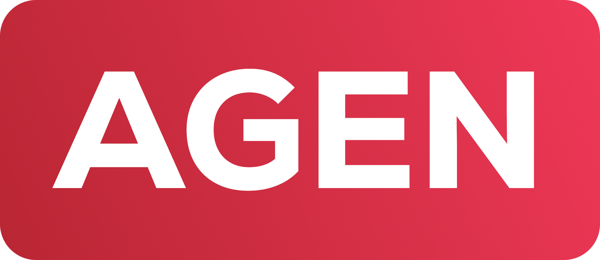

<p align="center">
	
</p>

<p align="center">
	<a href="./LICENSE">
		
	</a>
	<a href="https://github.com/avm-collection/agen/issues">
		
	</a>
	<a href="https://github.com/avm-collection/agen/pulls">
		
	</a>
</p>

An [AVM virtual machine](https://github.com/avm-collection/avm) program generator package for Go

## Table of contents
* [Quickstart](#quickstart)
* [Bugs](#bugs)

## Quickstart
```sh
$ go get github.com/avm-collection/agen
```

## Bugs
If you find any bugs, please create an issue and report them.
